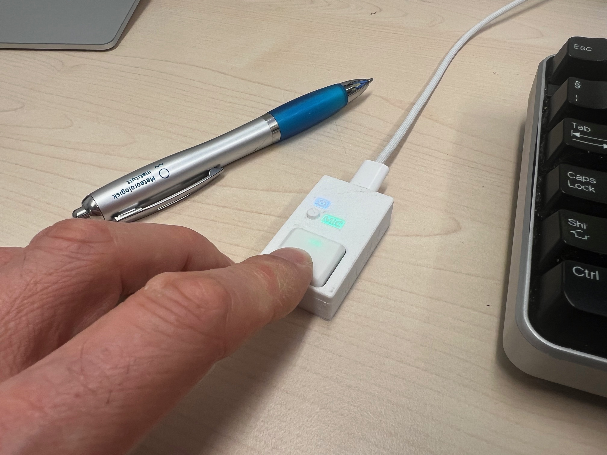

# PicoTalkButton

A compact push-to-talk (PTT) mute button for Linux using a Raspberry Pi Pico (RP2040) and a simple Python daemon.

This tool provides a **dedicated physical button** to temporarily unmute your microphone during calls — similar to a radio PTT button. The LED on the device reflects your mute status in real-time.



Youtube: https://youtu.be/i37_w7bP-I0

---

## Quick Install (Linux, Debian-based)

**Step 1 — Download the installer:**

```bash
curl -fsSL https://raw.githubusercontent.com/zerblatt007/PicoTalkButton/main/scripts/install.sh \
    -o ptt-install.sh
```

**Step 2 — Run it:**

```bash
bash ptt-install.sh
```

The script will:
1. Locate and download the latest `ptt-listen` `.deb` from this repository
2. Extract and run the embedded installer (sets up a Python venv + `pyserial`)
3. Register and start `ptt-listen.service` as a systemd user service
4. Run a health check and print useful post-install commands

> **Requirements:** `python3`, `dpkg`, `systemctl`, and `pactl`.
> - Ubuntu 22.04+ / PipeWire systems: `pactl` is already installed.
> - Older PulseAudio systems: `sudo apt install pulseaudio-utils`

After installation, plug in your PicoTalkButton USB device. The LED will turn red
(muted) once the host daemon connects.

---

## Uninstall

```bash
bash ~/.local/share/ptt-listen-install/ptt-listen/uninstall.sh
```

This stops and disables the service and removes all installed files.

---

## Troubleshooting

**The LED stays blue after plugging in**
The host daemon has not connected to the device yet. Check the service status:
```bash
systemctl --user status ptt-listen.service
```
If it is not running, start it:
```bash
systemctl --user start ptt-listen.service
```

**The button does not mute/unmute the correct microphone**
The daemon controls your system's default audio source. If you have multiple input devices, make sure the correct one is set as default in your system sound settings (e.g. GNOME Settings → Sound → Input).

To verify which source is currently active:
```bash
pactl get-default-source
```

**The service starts but immediately stops**
View the logs for details:
```bash
journalctl --user -fu ptt-listen.service
```
The most common cause is the USB device not being present — plug in the PicoTalkButton and restart the service.

**After a system reboot the service does not start automatically**
Enable it to start on login:
```bash
systemctl --user enable ptt-listen.service
```

---

## 🧩 What It Does

- Press and hold the button → your microphone is unmuted
- Release the button → your microphone is muted
- The onboard RGB LED shows current state:
  - 🟢 Green = Unmuted
  - 🔴 Red = Muted
  - 🔵 Blue (breathing) = Standby (host daemon not connected)
- A secondary **disable button** on the device pauses PTT control and keeps the mic unmuted — useful when you want to step away without unplugging. The LED still reflects the system mute state.

Works entirely in **user space**, no root required.

---

## 🎯 How It Works

### 📟 Device (RP2040 firmware)

The Raspberry Pi Pico acts as a USB **serial** device and controls the button and RGB LED.

- When the button is **pressed**, the device sends to the host:
PTT released
PTT pressed
- It listens for messages from the host:
MUTED
UNMUTED

- The LED updates based on the last status received.
- There is also a button on the Device for disabling the mute functionality, which means the host is unmuted. This removes the need for disconnecting the device and it still reflects the host mute status.

### 💻 Host (Linux + systemd service)

The `ptt-listen.py` script:

1. Opens the serial connection to the RP2040 Device.
2. Monitors messages:
 - On `PTT pressed`: unmutes the mic using:
   ```bash
   pactl set-source-mute @DEFAULT_SOURCE@ 0
   ```
 - On `PTT released`: mutes the mic using:
   ```bash
   pactl set-source-mute @DEFAULT_SOURCE@ 1
   ```
3. Listens for system mute status changes and reflects them back to the device with:
 - `MUTED`
 - `UNMUTED`

This keeps the device's LED perfectly in sync with the actual system microphone state — even if you mute/unmute through other tools.

---

### 🔌 Dependencies

- Python 3.x
- pyserial
- pactl (usually available via pulseaudio-utils or installed with PipeWire)

### 🛠️ Development Notes

- The firmware is written in C++ and built using PlatformIO.
- The host side is pure Python and installs using a .deb user package.
- Device LED defaults to breathing blue (standby) when host is not connected.
- Message protocol is intentionally minimal for robustness and clarity.
