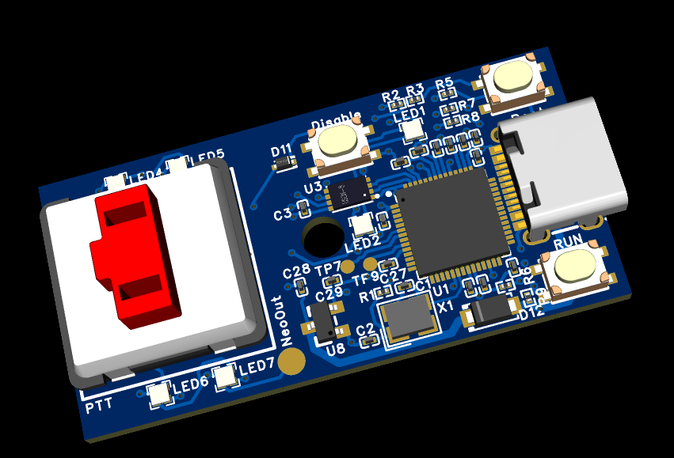

# Firmware for PicoTalkButton

This firmware runs on the Raspberry Pi Pico (RP2040) using PlatformIO.  

This development version is running on a DFRobot DFR0959 board like this: https://no.mouser.com/ProductDetail/DFRobot/DFR0959?qs=Jm2GQyTW%2FbjZmmIfIrcQfg%3D%3D

A specific board for this application is in the works and will be available to order from JLCPCB with components soldered. These components are so tiny, that soldering manually will be very difficult.

## Features with custom board

- Serial device acting as a push-to-talk button with Choc Switch.
- Status SK6805 LED for mute status with standby breath-blink.
- SK6805 LED for keycap background light.
- SK6805 LED for on/off status with button to enter standby mode.
- Easy to re-program with onboard BOOT & RUN button.
- 4 extra SK6805 LEDs for other uses if chosen to mount.
- 3D models of casing and buttons will be available.

## Building and Uploading

```bash
cd firmware
platformio run --target upload

## Checking USB device without host script running (stop ppt-listen if it is running)

```bash
systemctl --user stop ptt-listen.service
pio device monitor --port /dev/ttyACM0
```

## To manually check if there is contact, enter these commands (no local echo)
- VERSION  
    Answers(git version): VERSION: 1ad177e-dirty
- ACK  
    Answers: ACK
