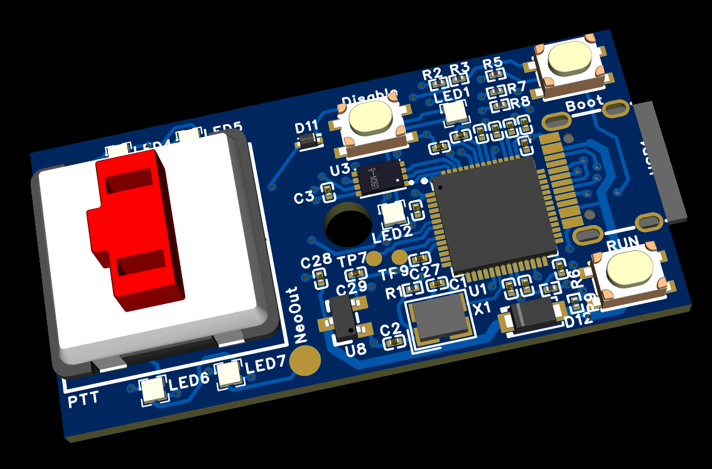
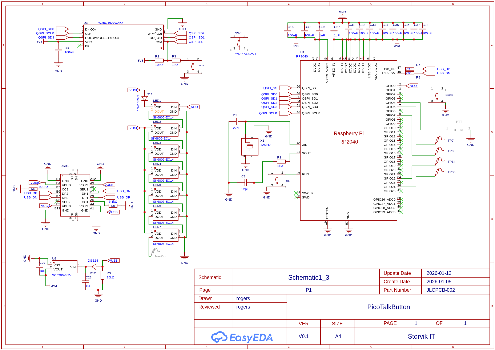
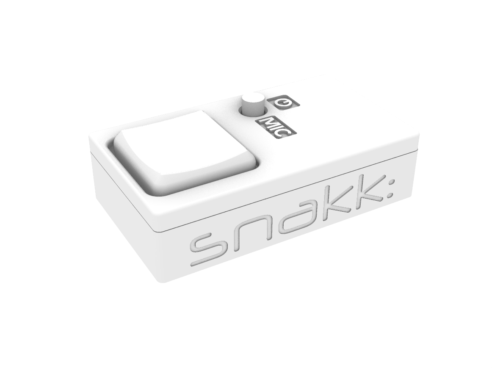

# PicoTalkButton – Hardware

This directory contains visual representations of the PicoTalkButton hardware design.

## Contents

### 1. 3D PCB View

3D render of the PCB showing component placement and physical layout.

---

### 2. Schematics

Electrical schematics illustrating how all components are connected.

---

### 3. Rendered Model of the 3D printed enclosure

Rendered view of the final device, showing the intended physical appearance.
